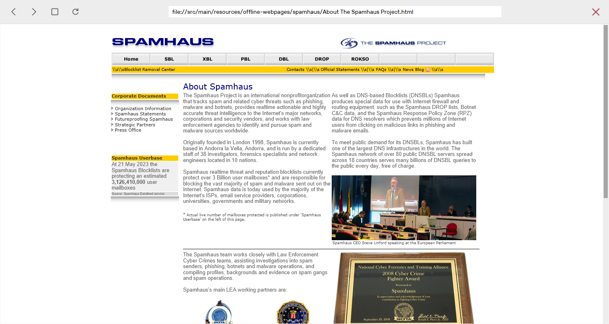
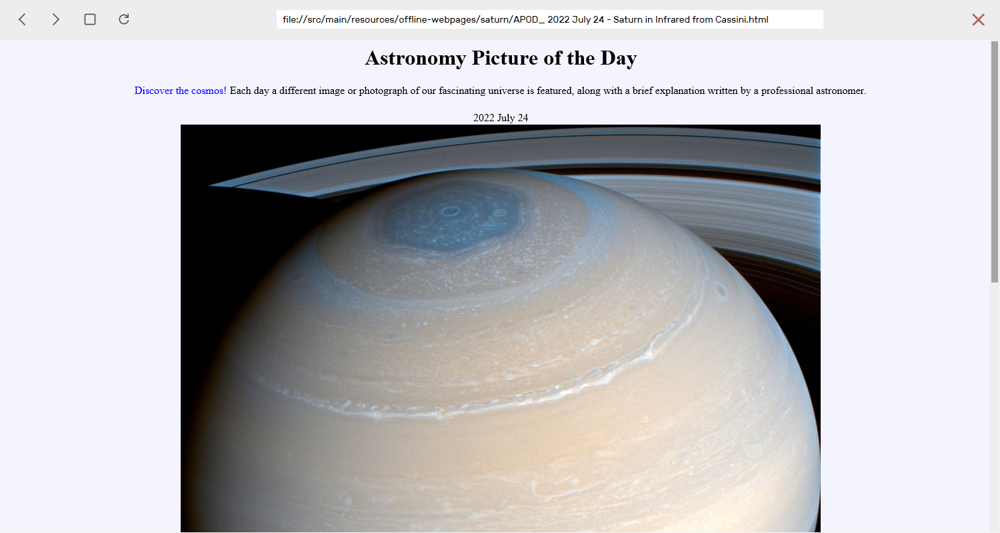
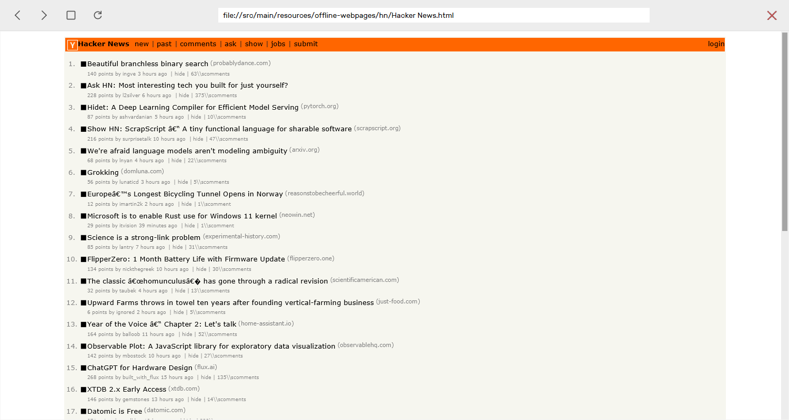
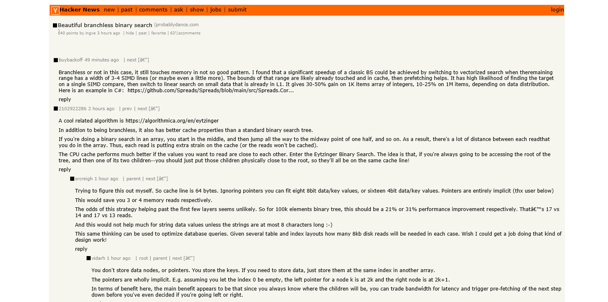
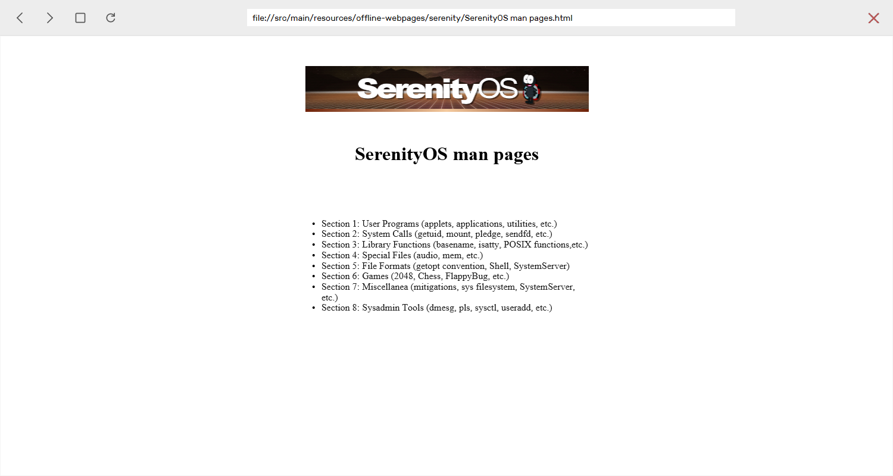

  

Kelp is my attempt at putting together an HTML and CSS rendering engine and using it to build a minimal web browser.

Enough of the essential HTML and CSS specifications required for older static webpages is implemented. This includes features such as flow layout, lists, tables, common CSS selectors, and media queries to name a few. Clickable links are supported, but other interactive features that require repainting such as hover CSS effects, forms, and scripting in general are not yet implemented.

Kelp relies on [the JavaFX Canvas class](https://docs.oracle.com/javase/8/javafx/api/javafx/scene/canvas/Canvas.html) to handle rendering text, images, and rectangles to its UI, and [the standard HttpUrlConnection class](https://docs.oracle.com/javase/8/docs/api/java/net/HttpURLConnection.html) for making GET requests for pages and their resources. The rest of the browser's pipeline, including HTML and CSS parsing, DOM tree creation, render tree creation, and box layout algorithms, is implemented within this codebase.

There are several features I plan to implement in the future that should unlock many of the more modern webpages, such as supporting CSS Flex and CSS Grid layouts.

A few sites rendered using Kelp:

